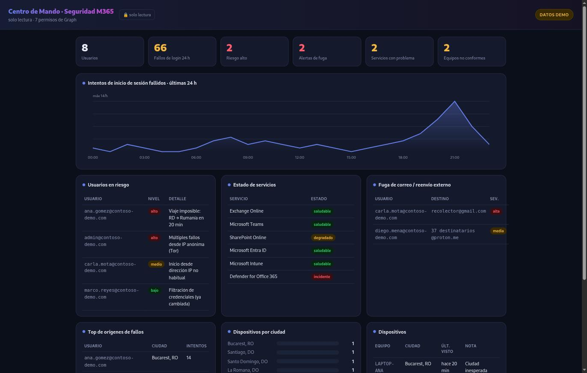

# M365 Command Center

**Every security signal that matters in a Microsoft 365 tenant, on one screen that
refreshes itself — failed logins, risky users, service health, mail exfiltration, and
where devices are signing in from.**


Read-only, always — it never writes to your tenant, and a test enforces that.

---

## The problem

Sign-in risk lives in Entra. Failed logons live in the audit logs. Service health is a
different blade. Mailbox forwarding rules are buried in Exchange. Device compliance is in
Intune. A small team ends up flipping between five consoles to answer one question —
*"is anything on fire right now?"* — and nobody keeps all five open.

This puts the signals that actually matter on a single page that refreshes on its own, so
the answer is one glance instead of five tabs.

## See it in 10 seconds — no tenant required

```bash
git clone https://github.com/earbona23/m365-command-center
cd m365-command-center
python -m app.server          # demo mode: synthetic data, no credentials
```

Open <http://127.0.0.1:8888>. Everything is **clearly labelled `DEMO DATA`** — it is
invented, from no real tenant, and it exists so you can see the whole thing working before
wiring anything up.



At a glance: the failed-login curve with its overnight brute-force spike, risky users with
the reason each was flagged, service health, external mail-forwarding alerts (the classic
sign of a compromised mailbox), and devices grouped by the city they last signed in from.

## What makes it worth running

- **It runs on synthetic data out of the box.** A dashboard you can't see never earns a
  second look — so this one shows its full self in one command, no tenant, no setup. The
  demo is loudly marked as demo; nothing invented is ever presented as real.
- **Read-only is a verified property, not a promise.** The Graph client exposes only
  `get()`/`get_all()`. `tests/test_readonly_guarantee.py` walks the code and fails if any
  Graph write verb appears — so "it only reads" is enforced, not asserted.
- **No external dependencies in the page.** Charts are hand-drawn inline SVG; there is no
  CDN, no third-party script. Smaller attack surface, and it works offline.
- **Local by default.** It binds to `127.0.0.1` and warns you if you expose it further — a
  SOC dashboard reachable from the internet is itself the leak.

## Connecting a real tenant

```bash
pip install -r requirements.txt
cp config.example.yaml config.yaml       # the secret goes in an env var, never the repo
export M365CC_CLIENT_SECRET=...
python -m app.server --live
```

**Permissions — all read-only:** `AuditLog.Read.All`, `IdentityRiskyUser.Read.All`,
`IdentityRiskEvent.Read.All`, `User.Read.All`, `Device.Read.All`, `ServiceHealth.Read.All`,
`MailboxSettings.Read`. If one is missing, that single panel stays empty with a note; the
rest of the dashboard still works.

## A note on privacy

Device location is shown at **city level, from sign-in logs** — the granularity Entra
actually provides. This deliberately does **not** collect or display precise GPS of
employee devices: that is personal monitoring with consent and legal implications well
beyond a security dashboard.

## Limitations

- **It's a read-only viewer, not a SIEM.** It doesn't store history, correlate over time, or
  alert. For that, use Sentinel; this complements it.
- **Detections are simple and honest.** External forwarding is flagged by comparing the
  forwarding domain to the user's own; it will miss forwarding done through inbox rules or
  connectors, and doesn't claim otherwise.
- **`--live` is unit-tested with mocked Graph responses.** Validate against your tenant
  before relying on it.
- **Never expose it to the internet without authentication in front.** It warns you when you
  bind beyond localhost.

## Contributing

New collectors are welcome — keep them read-only, add a mocked test, and the read-only
guarantee test holds the line. Run `pytest -q` and `ruff check .`.

## License

MIT — see [LICENSE](LICENSE).
